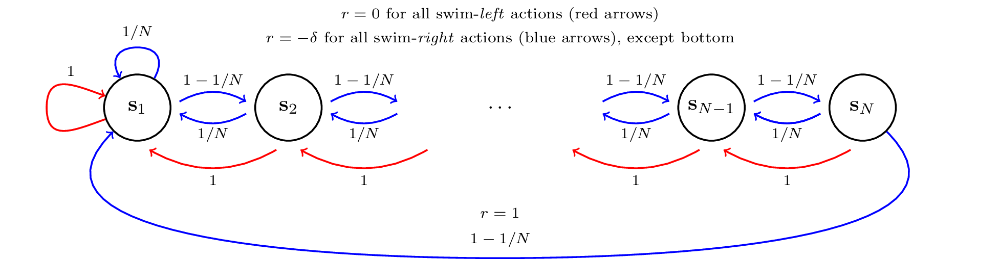
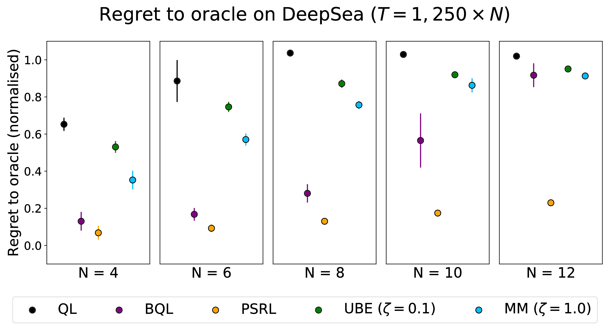
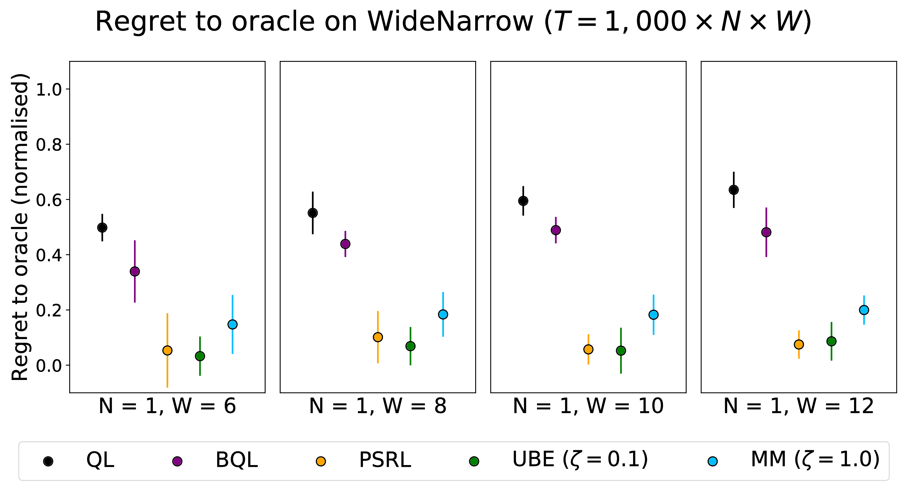
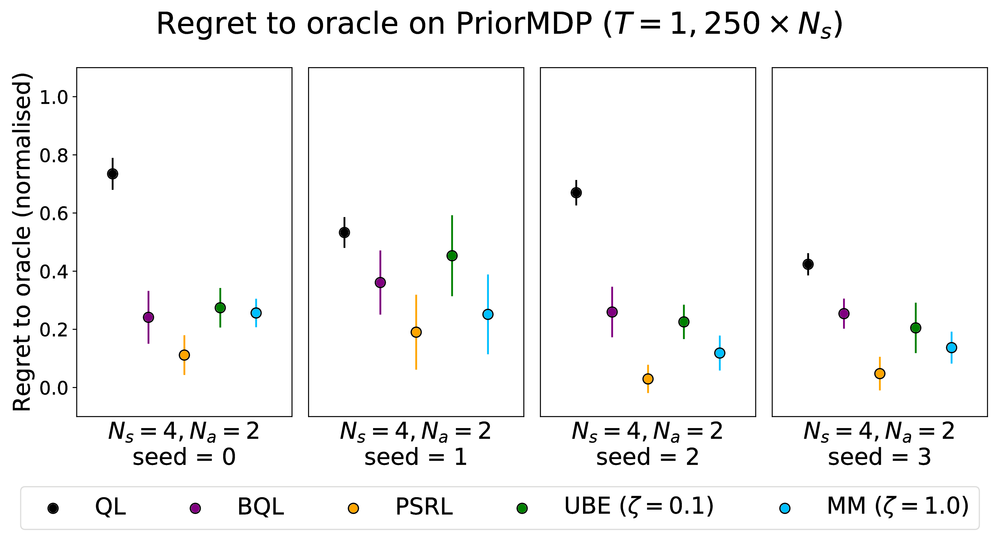
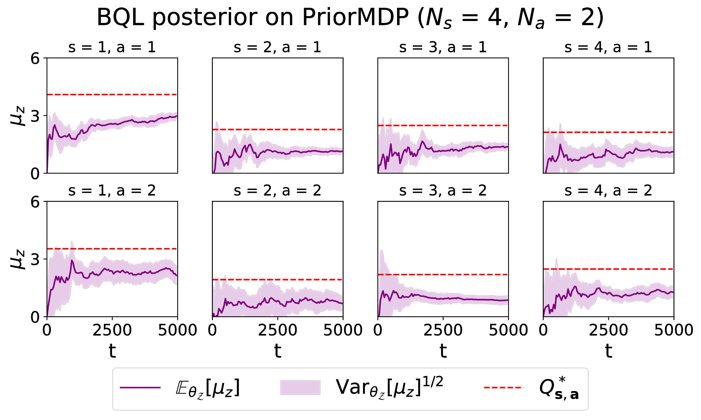
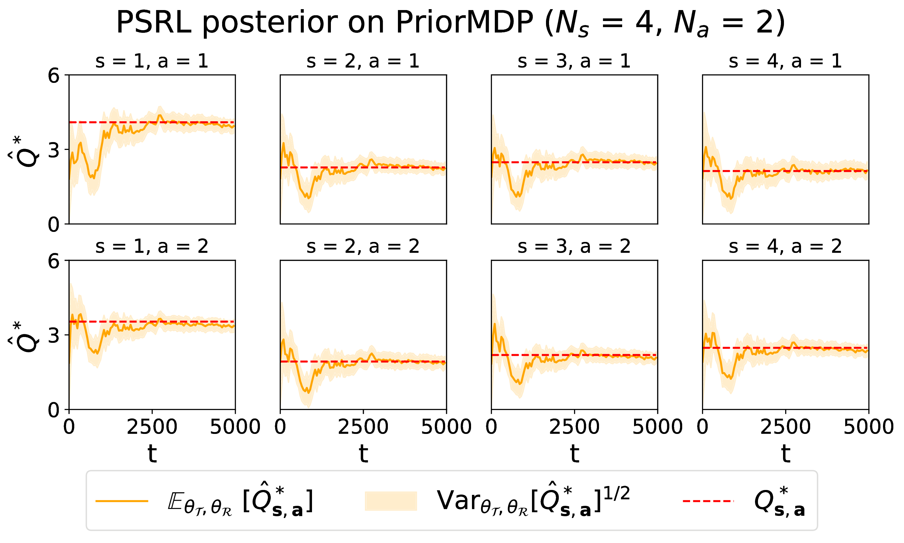
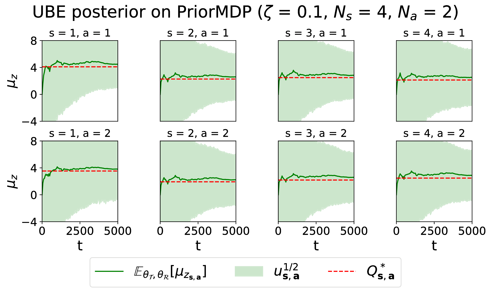
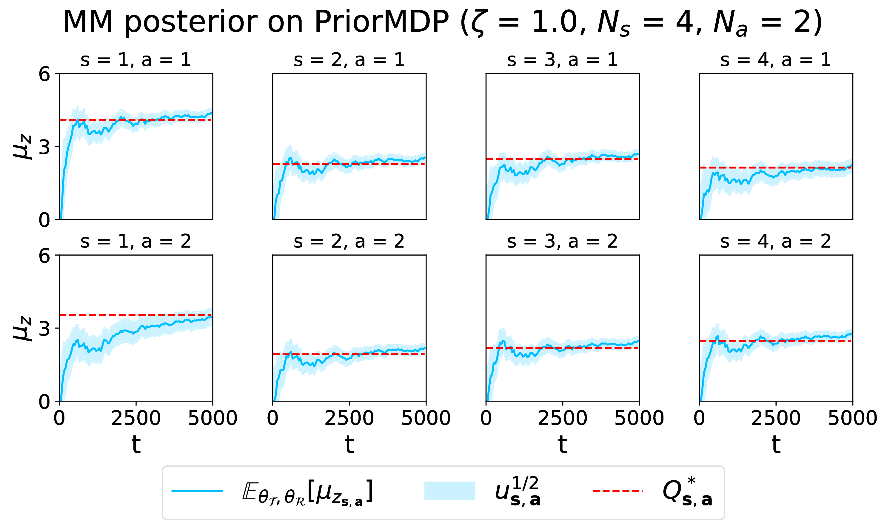

# Introduction
Source for the workshop paper: E. Markou and C. E. Rasmussen, <em>Bayesian methods for efficient Reinforcement Learning in tabular problems</em>, appearing in the 2019 NIPS Workshop on Biological and Artificial RL.

We compare different Bayesian methods for representing an RL agent's uncertainty about cumulative rewards, including our own approach based on moment matching across the Bellman equations.

| Method                                        | Authors             | Paper |
| :-------------------------------------------- | :------------------ | :---- |
| Bayesian Q-Learning                           | Dearden et. al.     | [link](https://www.aaai.org/Papers/AAAI/1998/AAAI98-108.pdf)  |
| Uncertainty Bellman Equation                  | O'Donoghue et. al.  | [link](https://arxiv.org/abs/1709.05380)  |
| Posterior Sampling for Reinforcement Learning | Osband et. al.      | [link](http://papers.nips.cc/paper/5185-more-efficient-reinforcement-learning-via-posterior-sampling)  |
| Moment Matching                               | Ours                | [link](https://github.com/stratisMarkou/sample-efficient-bayesian-rl/blob/master/writeup/bayesian-methods-for-rl.pdf)  |

# Evnironments

## DeepSea

Our DeepSea MDP is a variant of the ones used in \cite{rand_val_func, deepsea}. The agent starts from $\s_1$ and can choose swim-\textit{left} or swim-\textit{right} from each of the $N$ states in the environment. Swim-\textit{left} always succeeds and moves the agent to the left, giving $r = 0$ (red transitions). Swim-\textit{right} from $\s_1, ..., \s_{N-1}$ succeeds with probability $1 - 1/N$, moving the agent to the right and otherwise fails moving the agent to the left (blue arrows), giving $r \sim \mc{N}(-\delta, \delta^2)$ regardless of whether it succeeds. A successful swim-\textit{right} from $\s_N$ moves the agent back to $\s_1$ and gives $r = 1$. We choose $\delta$ so that \textit{right} is always optimal\footnote{We choose $\delta = 0.1 \times \exp^{-N / 4}$ in our experiments, which guarantees \textit{right} is optimal at least up to $N = 40$.}.

  

This environment is designed to test whether the agent continues exploring despite receiving negative rewards. Sustained exploration becomes increasingly important for large $N$. As argued in \cite{iothesis}, in order to avoid exponentially poor performance, exploration in such chain-like environments must be guided by uncertainty rather than randomness.

## WideNarrow

The WideNarrow MDP (\cref{widenarrowMDP}) has $2N + 1$ states and deterministic transitions. Odd states except $\s_{2N + 1}$ have $W$ actions, out of which one gives $r \sim \mc{N}(\mu_h, \sigma^2)$ whereas all others give $r \sim \mc{N}(\mu_l, \sigma^2)$, with $\mu_l < \mu_h$. Even states have a single action also giving $r \sim \mc{N}(\mu_l, \sigma^2)$. In our experiments we use $\mu_h = 0.5, \mu_l = 0$ and $\sigma_h = \sigma_l = 1$.

  

where $\btheta$ loosely denotes all modelling parameters, $\s'$ denotes the next-state from $(\s_1, \ac_1)$, $\s{''}$ denotes the next-state from $(\s_1, \ac_2)$ and $\ac{'}, \ac{''}$ denote the corresponding next-actions. Although the remaining three terms are non-zero under the posterior, BQL, UBE and MM ignore them, instead sampling from a factored posterior. The WideNarrow environment enforces strong correlations between these state actions, allowing us to test the impact of a factored approximation.

## PriorMDP

The aforementioned MDPs have very specific and handcrafted dynamics and rewards, so it is interesting to also compare the algorithms on environments which lack this sort of structure. For this we sample finite MDPs with $N_s$ states and $N_a$ actions from a prior distribution, as in \cite{psrl}. $\mct$ is a Categorical with parameters $\{\bs{\eta_{\s, \ac}}\}$ with:
\begin{align*}
\bs{\eta}_{\s, \ac} \sim \text{Dirichlet}(\bs{\kappa}_{\s, \ac}),
\end{align*}
with pseudo-count parameters $\bs{\kappa}_{\s, \ac} = \bm{1}$, while $\mcr \sim \mc{N}(\mu_{\s, \ac}, \tau_{\s, \ac}^{-1})$ with:
\begin{align*}
\mu_{\s, \ac}, \tau_{\s, \ac} \sim NG(\mu_{\s, \ac}, \tau_{\s, \ac} | \mu, \lambda, \alpha, \beta) \text{ with } (\mu, \lambda, \alpha, \beta) = (0.00, 1.00, 4.00, 4.00).
\end{align*}
We chose these hyperparameters because they give $Q^*$-values in a reasonable range.

# Results

## Regret summaries

  

  

  

## Posterior evolutions on PriorMDP

  
  

  
  

# Conclusions
